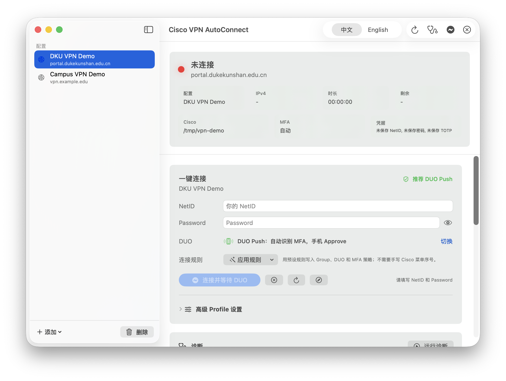

# Cisco VPN AutoConnect Mac

> **[English](#english)** | **[中文](#中文)**



<a id="english"></a>

## English

Cisco VPN AutoConnect Mac is a native macOS SwiftUI app for Cisco Secure Client. It helps you manage VPN profiles, store credentials in Keychain, connect with DUO Push, inspect local Cisco status, and diagnose common DKU/Duke VPN issues from one Mac app.

This is the Mac version I built. It was inspired by [guyong1449/cisco-vpn-autoconnect](https://github.com/guyong1449/cisco-vpn-autoconnect#%E4%B8%AD%E6%96%87), which focuses on a Windows PowerShell/CMD workflow. This repository brings that idea to macOS with a native app, SwiftPM core logic, Keychain storage, and Mac-specific diagnostics. The screenshot above is from this app, not from the upstream Windows project.

## Features

| Feature | Description |
|---|---|
| Native Mac app | SwiftUI interface packaged as `CiscoVPNMac.app` |
| DUO Push first | Daily DKU/Duke flow is optimized for DUO Push approval |
| Multi-profile management | Add DKU, Duke, custom, or URL-imported VPN profiles |
| Secure storage | NetID, password, and optional TOTP secret are stored in macOS Keychain |
| Mac diagnostics | Doctor checks Cisco CLI, `/usr/bin/expect`, VPN status, Keychain, profile metadata, and system proxy state |
| Bilingual UI | Switch the app between Simplified Chinese and English |
| Advanced TOTP fallback | Import a standard `otpauth://totp/...` or Base32 secret only when your account actually supports TOTP |
| DKU proxy warning | Surfaces the fixed `proxy-dku.oit.duke.edu:3128` proxy case that can break public HTTPS after the tunnel connects |

## Requirements

- Apple Silicon or Intel Mac running macOS 14+
- Cisco Secure Client installed with `/opt/cisco/secureclient/bin/vpn`
- Xcode Command Line Tools for local builds
- `/usr/bin/expect`, included with macOS

## Run From Source

```bash
git clone https://github.com/Cis-jujube/Cisco-VPN-Auto-Connect-Mac.git
cd Cisco-VPN-Auto-Connect-Mac

swift run CiscoVPNCoreSelfTests
bash script/build_and_run.sh
```

The run script builds and launches `dist/CiscoVPNMac.app` so SwiftUI has a stable app bundle. If no Apple Development or Developer ID certificate is available, local development builds are ad-hoc signed. That is enough for local testing, but distribution needs a real signing identity.

## Build Or Install

```bash
# Build a release app bundle in dist/
bash script/build_app.sh

# Copy the app to /Applications without sudo
bash script/install_to_applications.sh
```

`install_to_applications.sh` copies to `/Applications/Cisco VPN AutoConnect.app`. If `/Applications` is not writable by the current user, it exits with a clear message instead of asking for `sudo`.

## Storage And Safety

- Credentials are stored in Keychain service `CiscoVPNAutoConnect`.
- Profile metadata is stored in `~/Library/Application Support/Cisco VPN AutoConnect/`.
- Profile subscriptions may contain metadata only. They must not include NetID, passwords, TOTP secrets, API keys, or tokens.
- Logs and diagnostics redact raw credentials and generated MFA values.
- For DKU `Group: [-Default-]`, the Mac app submits an empty reply, equivalent to pressing Enter in Cisco Secure Client.

## Verification

```bash
swift run CiscoVPNCoreSelfTests
swift build
bash script/build_and_run.sh --verify
```

For isolated demos, screenshots, or tests that must not read your real profile metadata, set `CISCO_VPN_PROFILE_ROOT` to a temporary directory before launching the app.

## Project Layout

```text
Cisco-VPN-Auto-Connect-Mac/
├── Package.swift
├── Sources/
│   ├── CiscoVPNCore/          # VPN, profile, Keychain, DUO, Doctor logic
│   ├── CiscoVPNMac/           # Native SwiftUI app
│   └── CiscoVPNCoreSelfTests/ # Lightweight self-test executable
├── assets/
│   ├── CiscoVPNMac.icns
│   └── ciscovpnmac-screenshot.png
├── docs/
│   └── macos-app.md
└── script/
    ├── build_and_run.sh
    ├── build_app.sh
    ├── install_to_applications.sh
    └── sign_app.sh
```

## Attribution

The original idea came from [guyong1449/cisco-vpn-autoconnect](https://github.com/guyong1449/cisco-vpn-autoconnect#%E4%B8%AD%E6%96%87), a Windows-oriented Cisco VPN auto-connect project. This repository is my Mac implementation of that workflow.

This project is not affiliated with Cisco, Duke University, or Duke Kunshan University.

<a id="中文"></a>

## 中文

Cisco VPN AutoConnect Mac 是一个给 macOS 使用的原生 SwiftUI 应用，用来管理 Cisco Secure Client 的 VPN Profile、把凭据存入 Keychain、使用 DUO Push 连接、查看本机 Cisco 状态，并诊断 DKU / Duke VPN 的常见问题。

这是我自己做的 Mac 版本。项目灵感来自 [guyong1449/cisco-vpn-autoconnect](https://github.com/guyong1449/cisco-vpn-autoconnect#%E4%B8%AD%E6%96%87)，它主要是 Windows PowerShell/CMD 方案。这个仓库把同样的想法做成了 macOS 原生 App，包含 SwiftPM 核心逻辑、Keychain 安全存储和 Mac 侧诊断能力。上方截图来自这个 Mac App 本身，不是上游 Windows 项目的截图。

## 功能

| 功能 | 说明 |
|---|---|
| 原生 Mac App | SwiftUI 界面，打包为 `CiscoVPNMac.app` |
| 优先 DUO Push | 日常 DKU / Duke 登录流程以手机 Approve 为主 |
| 多 Profile 管理 | 可添加 DKU、Duke、自定义 VPN，或从 URL 导入 Profile 元数据 |
| 安全存储 | NetID、密码和可选 TOTP secret 存入 macOS Keychain |
| Mac 诊断 | Doctor 检查 Cisco CLI、`/usr/bin/expect`、VPN 状态、Keychain、Profile 元数据和系统代理 |
| 双语界面 | App 内可切换简体中文 / English |
| TOTP 高级备用 | 只有账号确实支持标准 `otpauth://totp/...` 或 Base32 secret 时才使用 |
| DKU 代理提示 | 可提示固定 `proxy-dku.oit.duke.edu:3128` 代理导致公网 HTTPS 失败的情况 |

## 前置条件

- Apple Silicon 或 Intel Mac，macOS 14+
- 已安装 Cisco Secure Client，并包含 `/opt/cisco/secureclient/bin/vpn`
- 本地构建需要 Xcode Command Line Tools
- `/usr/bin/expect`，macOS 自带

## 从源码运行

```bash
git clone https://github.com/Cis-jujube/Cisco-VPN-Auto-Connect-Mac.git
cd Cisco-VPN-Auto-Connect-Mac

swift run CiscoVPNCoreSelfTests
bash script/build_and_run.sh
```

运行脚本会构建并启动 `dist/CiscoVPNMac.app`，让 SwiftUI 获得稳定的 app bundle。没有 Apple Development 或 Developer ID 证书时，本地开发构建会使用 ad-hoc 签名；这足够本机测试，但正式分发需要真实签名身份。

## 构建或安装

```bash
# 在 dist/ 生成 release app bundle
bash script/build_app.sh

# 不使用 sudo，复制到 /Applications
bash script/install_to_applications.sh
```

`install_to_applications.sh` 会复制到 `/Applications/Cisco VPN AutoConnect.app`。如果当前用户没有 `/Applications` 写入权限，脚本会明确退出，不会要求 `sudo`。

## 存储与安全

- 凭据存储在 Keychain service `CiscoVPNAutoConnect`。
- Profile 元数据存储在 `~/Library/Application Support/Cisco VPN AutoConnect/`。
- Profile 订阅只能包含元数据，不能包含 NetID、密码、TOTP secret、API key 或 token。
- 日志和诊断会隐藏原始凭据和生成的 MFA 值。
- DKU 的 `Group: [-Default-]` 会提交空回复，相当于在 Cisco Secure Client 里直接按 Enter。

## 验证

```bash
swift run CiscoVPNCoreSelfTests
swift build
bash script/build_and_run.sh --verify
```

如果要做隔离演示、截图或测试，并且不希望读取真实 Profile 元数据，可以在启动 App 前把 `CISCO_VPN_PROFILE_ROOT` 设置为临时目录。

## 项目结构

```text
Cisco-VPN-Auto-Connect-Mac/
├── Package.swift
├── Sources/
│   ├── CiscoVPNCore/          # VPN、Profile、Keychain、DUO、Doctor 逻辑
│   ├── CiscoVPNMac/           # 原生 SwiftUI App
│   └── CiscoVPNCoreSelfTests/ # 轻量自测可执行目标
├── assets/
│   ├── CiscoVPNMac.icns
│   └── ciscovpnmac-screenshot.png
├── docs/
│   └── macos-app.md
└── script/
    ├── build_and_run.sh
    ├── build_app.sh
    ├── install_to_applications.sh
    └── sign_app.sh
```

## 致谢

最初灵感来自 [guyong1449/cisco-vpn-autoconnect](https://github.com/guyong1449/cisco-vpn-autoconnect#%E4%B8%AD%E6%96%87)。原项目主要面向 Windows 的 Cisco VPN 自动连接流程；这个仓库是我做的 Mac 原生实现。

本项目不隶属于 Cisco、Duke University 或 Duke Kunshan University。
