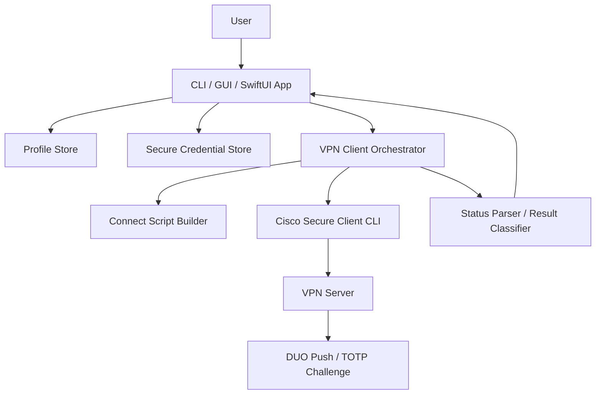

# Cisco VPN AutoConnect 项目技术报告

## 摘要

Cisco VPN AutoConnect 是一个面向 Cisco Secure Client 的自动连接工具，目标是把校园或企业 VPN 登录过程中的重复操作自动化，并在不牺牲凭据安全的前提下提供更低门槛的图形界面和命令行体验。项目最初以 Windows PowerShell/CMD 脚本为核心，支持配置管理、Cisco VPN CLI 驱动、DUO Push / TOTP 双因素认证、二维码 TOTP 密钥提取和 Python GUI；随后扩展出 macOS SwiftPM / SwiftUI 原生客户端，使用 macOS Keychain 存储凭据，并通过 Cisco Secure Client 的 `vpn -s` 终端式接口完成连接。

本项目的实践重点不是重新实现 VPN 协议，而是围绕 Cisco 官方客户端进行稳定、可审计、跨平台的自动化封装。技术实现覆盖命令行进程编排、终端交互状态机、凭据安全存储、多 Profile 管理、MFA 适配、macOS 应用打包运行，以及自测验证体系。

## 关键词

Cisco Secure Client、VPN 自动化、DUO Push、TOTP、PowerShell、SwiftUI、macOS Keychain、Expect、SwiftPM、跨平台工具

## 一、项目背景与目标

在日常学习或办公环境中，VPN 登录通常包含多个重复步骤：打开 Cisco Secure Client、选择服务器和 Group、输入 NetID 与密码、等待 DUO Push 或输入动态验证码、确认连接状态。手动流程容易受到以下因素影响：

- 登录步骤重复，日常使用成本高。
- 不同 VPN Group、不同学校或组织的配置容易混淆。
- DUO Push、多设备 Push、TOTP Passcode 等认证方式在不同环境下表现不完全一致。
- Cisco GUI 或旧 `vpncli` 进程可能占用连接能力，导致自动化脚本失败。
- 凭据不能以明文散落在脚本、配置文件或日志中。

因此，本项目设定了四个核心目标：

1. 提供一键连接能力，减少手动输入和重复配置。
2. 支持多 Profile，使 DKU、Duke 或其他自定义 VPN 配置可以并存。
3. 在 Windows 和 macOS 上采用各自平台的安全存储机制保存凭据。
4. 对 Cisco CLI、DUO、TOTP 和连接状态进行可诊断、可验证的自动化封装。

## 二、项目功能概述

### 2.1 Windows 端能力

Windows 端以 `vpn-auto-connect.ps1` 为核心，辅以 `cmd/` 目录中的批处理入口，提供以下功能：

- `vpn-connect`：连接当前激活 Profile，默认使用 DUO Push。
- `vpn-disconnect`：断开当前 VPN。
- `vpn-status`：查看 Cisco VPN 连接状态。
- `vpn-config`：新增、切换、删除、查看、修改多 Profile 配置。
- `vpn-gui`：启动 Python 图形界面，降低配置和连接门槛。
- `qrgui` / `qrdecode`：从标准 `otpauth://totp/...` 二维码中提取 TOTP Base32 secret。

Windows 凭据使用 DPAPI 当前用户作用域加密，避免把密码以明文写入仓库或普通配置文件。

### 2.2 macOS 端能力

macOS 端是一个 SwiftPM 项目，包含：

- `CiscoVPNCore`：VPN 路径解析、Profile 模型、Keychain 凭据存储、Cisco CLI 交互、结果分类、TOTP 生成与导入等核心逻辑。
- `CiscoVPNMac`：SwiftUI 原生界面，提供 Profile 编辑、连接、断开、状态刷新、日志诊断和 TOTP 导入。
- `CiscoVPNCoreSelfTests`：轻量级自测目标，覆盖核心解析、状态机、MFA 适配和脱敏逻辑。

macOS 端通过 `/opt/cisco/secureclient/bin/vpn -s` 驱动 Cisco Secure Client，并使用 `/usr/bin/expect` 模拟终端式交互，使 Cisco CLI 能看到接近人工输入的登录流程。凭据存储在 macOS Keychain 的 `CiscoVPNAutoConnect` service 下，Profile 元数据存储在 `~/Library/Application Support/Cisco VPN AutoConnect/`。

## 三、实践路径

项目的实践路径可以概括为“先解决可用性，再补齐安全性、跨平台能力和可验证性”。

### 3.1 阶段一：命令行自动化原型

第一阶段聚焦 Windows 命令行。项目通过 PowerShell 调用 Cisco `vpncli.exe`，把人工登录流程拆成固定输入序列：

```text
connect -> group -> username -> password -> MFA -> accept -> exit
```

这一阶段验证了自动化连接的基本可行性，也形成了后续所有平台共享的抽象：Profile、Credential、连接脚本、状态查询和连接结果分类。

### 3.2 阶段二：多 Profile 与配置管理

单一脚本只能满足固定服务器和固定账号场景。为了支持 DKU、Duke 和自定义 VPN，项目引入多 Profile 管理：

- 每个 Profile 保存 server、Group、port、protocol、DUO method、push target 等信息。
- 用户可以新增、删除、切换、列出 Profile。
- DKU 和 Duke 提供预设，减少用户理解 Cisco Group 菜单的负担。

这一阶段的核心收益是把“脚本参数”提升为“可管理配置”，使工具适合长期使用。

### 3.3 阶段三：MFA 适配与 TOTP 支持

VPN 登录中的 MFA 不是单一形式。项目同时支持：

- DUO Push：默认推荐方式，用户在手机端 Approve。
- 多设备 Push：通过 push target 选择第几个设备。
- TOTP Passcode：本地生成 6 位动态验证码并自动填入。
- TOTP QR 导入：从标准 `otpauth://totp/...` 链接或二维码提取 Base32 secret。

同时，项目明确区分 `duo://` 激活链接和标准 TOTP secret。DKU 的 DUO 二维码通常是激活链接，不等价于 TOTP secret，因此 DKU 场景优先使用 DUO Push。

### 3.4 阶段四：GUI 与用户体验

命令行适合脚本化，但日常使用更适合图形界面。项目在 Windows 端提供 Python GUI，在 macOS 端提供 SwiftUI 原生 App。GUI 的重点不是展示复杂参数，而是把常用流程压缩到少数操作：

- 选择或创建 Profile。
- 输入 NetID 和 Password。
- 选择 DUO Push 或 TOTP。
- 点击 Connect / Disconnect。
- 查看状态和诊断日志。

macOS UI 还针对密码输入和登录失败提供诊断提示，例如只显示密码长度、是否含非 ASCII、是否有首尾空格、是否含换行或控制字符，不显示密码本身。

### 3.5 阶段五：macOS 原生化与启动路径修正

macOS 端一开始可以直接运行 SwiftPM 生成的 GUI executable，但裸 `.build/.../CiscoVPNMac` 缺少稳定 bundle identifier，SwiftUI / AppKit 在某些情况下会自动终止应用。项目最终改为由 `script/build_and_run.sh` 构建并启动本地 `dist/CiscoVPNMac.app`：

```bash
swift run CiscoVPNCoreSelfTests
swift build
bash script/build_and_run.sh --verify
bash script/build_and_run.sh
```

该路径会生成 app bundle，并通过 LaunchServices 启动，使 SwiftUI 获得稳定的 bundle 环境。没有 Apple Development 或 Developer ID 签名身份时，本地开发运行和验证可以使用 ad-hoc 签名；长期 Finder 安装或分发仍需要真实签名身份。

### 3.6 阶段六：认证失败诊断

在 DKU 登录调试中，日志显示 Cisco 在 MFA 之前返回 `Login failed`。这说明问题不在 TOTP 或 DUO Push，而更可能是 NetID、Password 或 Group。项目据此强化了两个行为：

- DKU `-Default-` Group 在 Cisco `Group: [-Default-]` 提示处提交空回车，等价于人工直接按 Enter。
- 如果保存密码诊断显示 `passwordASCII=no`，界面会提示密码包含非 ASCII 字符，例如中文输入法或全角标点可能导致认证失败。

这样可以减少用户把“登录失败”误判为 TOTP 或 DUO 配置问题。

## 四、技术架构

### 4.1 总体架构



项目不直接实现 VPN 协议，而是以 Cisco Secure Client CLI 为边界。应用层负责准备配置、保护凭据、驱动交互、解析结果和呈现诊断。

### 4.2 macOS 模块划分

| 模块 | 位置 | 职责 |
|---|---|---|
| 数据模型 | `Sources/CiscoVPNCore/Models.swift` | Profile、Secret、状态、错误类型 |
| CLI 路径解析 | `CiscoVPNPathResolver.swift` | 查找 Cisco `vpn` binary |
| 连接编排 | `CiscoVPNClient.swift` | 调用 Cisco CLI、Expect 交互、超时处理 |
| 连接脚本 | `CiscoVPNConnectScript.swift` | 生成 connect、group、username、password、MFA 输入步骤 |
| 状态解析 | `CiscoVPNStatsParser.swift` | 解析 `stats` 输出 |
| 结果分类 | `CiscoVPNResultClassifier.swift` | 区分 connected、authentication failed、waiting 等结果 |
| Profile 存储 | `FileProfileStore.swift` | 保存 Profile metadata 和 active profile |
| Keychain 存储 | `KeychainCredentialStore.swift` | 保存用户名、密码、TOTP secret |
| TOTP | `TOTPGenerator.swift` / `TOTPSecretImporter.swift` | 生成验证码、导入 Base32 secret |
| SwiftUI 状态管理 | `Sources/CiscoVPNMac/Stores/VPNAppStore.swift` | UI 状态、连接动作、日志与错误提示 |
| SwiftUI 视图 | `Sources/CiscoVPNMac/Views/` | 主界面、Profile 编辑、状态卡片、日志面板 |

### 4.3 数据与凭据流

macOS 端将 Profile 元数据和敏感凭据分开存储：

```text
Profile metadata:
~/Library/Application Support/Cisco VPN AutoConnect/profiles.json

Sensitive credentials:
macOS Keychain
service = CiscoVPNAutoConnect
account = profile:<profile-id>
```

这种设计的好处是：

- Profile 文件可以被人类检查和备份，但不包含密码。
- 密码和 TOTP secret 交给系统 Keychain 管理。
- 日志只输出脱敏信息，例如 `<username>`、`<password>`、`<mfa>`。

### 4.4 Cisco CLI 交互状态机

连接过程的核心是按 Cisco CLI 当前提示动态发送输入，而不是盲目一次性写入所有命令。macOS 端使用 Expect 识别以下提示或状态：

- Group prompt：解析 Cisco 返回的 Group 菜单，匹配用户保存的 Group。
- Username prompt：输入保存的 NetID。
- Password prompt：输入保存的密码，必要时支持单密码字段追加 DUO factor。
- MFA prompt：识别数字菜单、Second Password、自动 Push、无明确 challenge 等不同模式。
- Connected / Login failed / Timeout：分类结果并反馈给 UI。

这一状态机使工具能适配不同 Cisco/Duo 服务器策略，而不依赖单一固定输出格式。

## 五、关键技术实现

### 5.1 Group 解析

DKU 场景中，Cisco 会显示类似：

```text
0) -Default-
1) Library Resources Only
Group: [-Default-]
```

项目的规则是：

- 如果用户保存 Group 为 `-Default-` 或空值，则发送空回车，接受 Cisco 默认值。
- 如果用户显式保存数字 Group，例如 `0` 或 `1`，则发送该数字。
- 如果保存的是 Group 名称，例如 `Library Resources Only`，则从实时菜单中解析对应序号。
- 如果实时菜单里找不到配置的 Group，则返回可理解的错误提示。

### 5.2 DUO Push 适配

DUO Push 在 Cisco CLI 中可能表现为多种形式：

- 数字菜单：输入 `1`、`2` 等设备选项。
- Second Password：输入 `push` 或 `push2`。
- 单密码追加模式：输入 `password,push` 或 `password,push2`。
- 自动 Push：服务器已经发起推送，客户端只需要等待。

项目通过输出模式识别选择不同输入策略，避免在自动 Push 场景中发送多余的 `1`，也避免在 second password 场景中误填数字。

### 5.3 TOTP 生成与导入

TOTP 模块实现 RFC 6238 风格的动态验证码生成，并支持两类输入：

- 标准 `otpauth://totp/...` 链接。
- 原始 Base32 secret。

项目会拒绝 `duo://` 激活链接，因为它不是 TOTP secret，不能生成验证码。这一判断对 DKU 场景尤其重要。

### 5.4 macOS App Bundle 运行

SwiftPM 可以生成可执行文件，但 SwiftUI GUI 应用在 macOS 上需要稳定的 bundle 环境。项目脚本 `script/build_and_run.sh` 承担以下职责：

1. 构建 `CiscoVPNMac`。
2. 创建 `dist/CiscoVPNMac.app`。
3. 写入 `Info.plist`、资源和可执行文件。
4. 使用可用签名身份签名；本地开发可 fallback 到 ad-hoc 签名。
5. 通过 LaunchServices 打开 app。
6. 在 `--verify` 模式下做启动 smoke test。

## 六、安全设计

本项目处理 VPN 凭据，因此安全设计是核心要求。

### 6.1 凭据不进仓库

仓库不保存真实 NetID、密码、TOTP secret 或生产私有配置。Windows 使用 DPAPI，macOS 使用 Keychain。Profile metadata 与 secret 分离，避免普通 JSON 文件持有敏感字段。

### 6.2 日志脱敏

连接日志可能包含 Cisco CLI 回显，因此项目在展示前替换敏感值：

- 用户名显示为 `<username>`。
- 密码显示为 `<password>`。
- MFA/TOTP 显示为 `<mfa>`。
- TOTP secret 显示为 `<totp-secret>`。

诊断信息只显示长度和字符类别，例如：

```text
NetID chars=5; password chars=12; passwordASCII=no; passwordEdgeWhitespace=no
```

这类信息足以定位输入法、全角标点、换行等问题，但不会泄露密码内容。

### 6.3 外部进程边界

项目通过 Cisco 官方 CLI 与 VPN 服务交互，不绕过 Cisco Secure Client，也不直接处理 VPN 隧道协议。连接前会结束可能占用连接能力的 Cisco GUI 或旧 CLI 进程，减少本地进程锁导致的失败。

### 6.4 真实登录重试克制

当 Cisco 在 DUO 前返回 `Login failed`，项目优先提示用户检查 NetID、Password 和 Group，而不是反复重试真实登录。这可以降低账号锁定或触发安全策略的风险。

## 七、测试与验证

### 7.1 自测目标

macOS 端提供 `CiscoVPNCoreSelfTests`，不依赖 XCTest，而是用 SwiftPM 可执行目标进行自测。覆盖范围包括：

- Cisco binary 路径解析。
- `stats` 输出解析。
- Group 菜单解析。
- Profile 与 secret 规范化。
- 连接脚本生成与脱敏。
- fake Cisco CLI 的终端交互。
- DUO numeric menu、second password、single-password append、auto-push 等 MFA 模式。
- TOTP RFC 向量。
- TOTP import 与 `duo://` 拒绝。
- Keychain/Profile 分离保存。

常用验证命令：

```bash
swift run CiscoVPNCoreSelfTests
swift build
bash script/build_and_run.sh --verify
```

### 7.2 手动验证重点

真实 VPN 登录依赖账号、密码、DUO 手机审批和网络环境，不能完全由自动化测试替代。手动验证应关注：

- Cisco Secure Client 是否安装且 `vpn` CLI 可执行。
- Profile server、Group、port、DUO method 是否正确。
- Keychain 是否保存了当前 Profile 的凭据。
- 连接失败是否发生在 DUO 前还是 DUO 后。
- 日志是否脱敏且能提供足够诊断信息。
- macOS app bundle 是否能稳定启动并保持运行。

## 八、问题与解决方案

### 8.1 DKU 默认 Group 选择

问题：直接发送 `0` 选择 `-Default-` 在部分场景下可能不如人工按 Enter 稳定。

解决：当 Group 为 `-Default-` 或空值时，提交空回车，接受 Cisco CLI 当前默认值；如果用户显式输入 `0`，仍支持发送 `0`。

### 8.2 DUO 前登录失败

问题：日志显示 Cisco 在 MFA 前返回 `Login failed`，容易被误判为 TOTP 或 DUO 配置错误。

解决：结果分类和 UI 提示强调优先检查 NetID、Password、Group。若密码诊断显示 `passwordASCII=no`，提示用户确认是否误用了中文输入法或全角标点。

### 8.3 macOS 裸可执行文件自动退出

问题：直接运行 SwiftPM GUI executable 时，SwiftUI/AppKit 可能因为缺少 bundle identifier 或窗口恢复问题自动终止。

解决：将默认运行路径切换为构建并打开 `dist/CiscoVPNMac.app`，通过 LaunchServices 启动。

### 8.4 TOTP 与 DUO 激活链接混淆

问题：用户可能把 `duo://` 激活链接当作 TOTP secret。

解决：导入器明确拒绝 `duo://`，并提示 DKU 常用 DUO Push。

## 九、项目成果

本项目最终形成了一个具有实际使用价值的跨平台 VPN 自动连接工具：

- Windows：命令行、批处理入口、Python GUI、DPAPI 凭据保护。
- macOS：SwiftUI 原生 App、Keychain 凭据保护、Expect 终端交互、app bundle 启动验证。
- 通用能力：多 Profile、DUO Push、TOTP、二维码导入、状态解析、日志脱敏和诊断。
- 工程质量：自测目标、运行脚本、文档、项目级 agent 指南。

## 十、后续改进方向

1. 增加正式 XCTest 或 Swift Testing 测试套件，提升 IDE 和 CI 集成能力。
2. 增加 GitHub Actions 或本地 CI 脚本，对 SwiftPM 构建、自测和 PowerShell 静态检查做统一验证。
3. 完善 Windows GUI 与 macOS GUI 的界面一致性，使 Profile 编辑、状态诊断和 TOTP 导入体验更统一。
4. 支持更清晰的连接失败分层，例如账号错误、Group 错误、DUO 超时、Cisco 进程锁、网络不可达。
5. 增加正式 macOS 签名、notarization 和安装包流程，降低分发成本。
6. 增加更完整的用户手册和故障排查手册，覆盖常见 Cisco Secure Client 版本差异。

## 结论

Cisco VPN AutoConnect 的价值在于把复杂但重复的 VPN 登录流程转化为可配置、可诊断、可验证的自动化工具。项目没有试图绕过 Cisco Secure Client 的安全模型，而是在官方 CLI 之上构建更友好的使用层：用 Profile 管理降低配置成本，用系统级安全存储保护凭据，用终端交互状态机适配 DUO/TOTP 变化，用自测和文档保证后续维护可持续。

从实践路径看，该项目体现了一个实用软件从脚本原型到跨平台原生应用的演进过程：先解决真实痛点，再逐步补齐安全、用户体验、平台适配和工程验证。这也是该项目最重要的工程经验。
