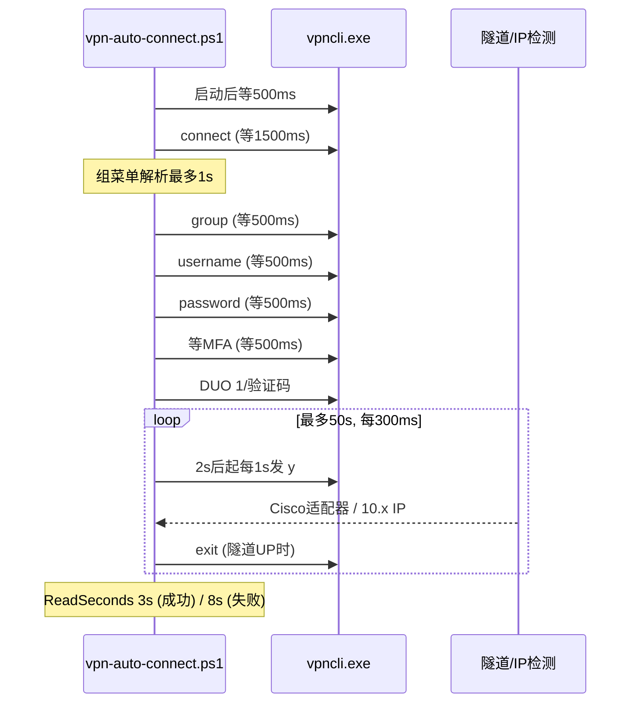

# 时间相关实现清单（以当前代码为准）

核对来源：`vpn-auto-connect.ps1`、`tools/vpn-gui.py`、`tests/Test-VpnFunctions.ps1`（2026-06-07）

---

## 1. 全局常量

| 位置 | 常量 | 含义 |
|------|------|------|
| `vpn-auto-connect.ps1:104` | `$VpnSessionLimitSeconds = 24 * 60 * 60` | 会话上限 24 小时，用于计算 Remaining |
| `tools/vpn-gui.py:41` | `SESSION_LIMIT_SECONDS = 24 * 60 * 60` | 同上，GUI 会话计时 |
| `Get-TOTPCode` (`vpn-auto-connect.ps1:1013-1014`) | `[math]::Floor($epoch / 30)` | RFC 6238，每 **30 秒**轮换一次验证码 |

---

## 2. CLI 连接流程 — 固定延迟（`Invoke-VpnConnectTimed`）

`vpn-auto-connect.ps1` 各步骤之间的 `Start-Sleep -Milliseconds`：

| 步骤 | 延迟 | 说明 |
|------|------|------|
| 启动后 | **500ms** | 首条 stdin 前 |
| `[1/6] connect` 后 | **1500ms** | 等待服务器响应 |
| `[1/6]` 与 `[2/6]` 之间 | 最多 **1s**（额外） | `Get-VpnGroupSelection` → `Wait-ForVpnGroupMenuOptions`，每 **250ms** 轮询组菜单 |
| `[2/6] group` 后 | **500ms** | |
| `[3/6] username` 后 | **500ms** | |
| `[4/6] password` 后 | **500ms** | |
| `[5/6] MFA prompt` 前 | **500ms** | 等 DUO 提示出现 |
| DUO 后轮询 | 最多 **50s** | `Wait-ForVpnTunnelAfterMfa` |

**固定 sleep 合计：4.0s**（不含组菜单最多 1s、不含 DUO 审批与隧道建立）。

**经验耗时（README）：** 约 **30s + DUO 审批**（非硬编码上限；随网络与 Push 延迟波动）。

**脚本侧理论上限（仅计时逻辑）：** 4s 固定 + 1s 组菜单 + 50s MFA 轮询 + 3s 读输出 ≈ **58s**（不含 `Stop-CiscoClientBlockers`、网络与 DUO 人工审批）。

**隧道 UP 优化：** `Wait-ForVpnTunnelAfterMfa` 与早成功分支在检测到隧道 IP 后立即向 vpncli 发送 `exit`，减少 `Read-VpnCliOutputFinal` 空等。

---

## 3. 等待 / 轮询函数（PowerShell）

| 函数 | 默认参数 | 用途 | 连接路径是否使用 |
|------|----------|------|------------------|
| `Wait-ForVpnGroupMenuOptions` | 等 **1s**，每 **250ms** | 解析 Cisco 组菜单 | 是（组选择前） |
| `Get-VpnGroupSelection` | `MenuWaitSeconds = 1` | 调用上面的等待 | 是 |
| `Wait-ForVpnPrompt` | 超时 **30s**，每 **200ms** | 按 stdout 模式等待 | 否（仅测试） |
| `Wait-VpnStepOrDelay` | 可配 `MaxSeconds`，每 **200ms** | 按模式等待或超时 | 否（仅测试） |
| `Wait-ForVpnIpAfterExit` | **5s**，每 **300ms** | vpncli 退出后查隧道 IP | 是（MFA 轮询内） |
| `Wait-ForVpnTunnelAfterMfa` | **50s**，每 **300ms**；**2s** 后发首个 `y`；之后每 **1s** 重发 banner/cert `y`；隧道 UP 发 `exit` | MFA 后等隧道 | 是 |
| `Read-VpnCliOutputFinal` | 默认 **15s** `WaitForExit` | 进程结束后读 stdout | 是（多处） |
| `Complete-VpnConnectTimed` | `ReadSeconds`: **3 / 8**（成功 / 失败） | 连接收尾读输出 | 是 |

**`Read-VpnCliOutputFinal` / `Complete-VpnConnectTimed` 调用点：**

| 场景 | `MaxSeconds` / `ReadSeconds` |
|------|------------------------------|
| 密码后 vpncli 已退出 | **5s** |
| 隧道已 UP（早成功） | **3s** |
| DUO 后 vpncli 已退出 | **8s** |
| 正常 MFA 轮询结束（成功） | **3s** |
| 正常 MFA 轮询结束（失败） | **8s** |
| `group` stdin 失败诊断 | **3s** |
| `Complete-VpnConnectTimed` 默认 | **15s** |

**进程退出 / 清理等待：**

| 函数 | 时间 |
|------|------|
| `Stop-VpnCliSession` | `WaitForExit(3000)` → 否则 Kill |
| `Stop-VpnCliForFailureAndDrain` | Kill 后 `WaitForExit(3000)` |
| `Invoke-VpnCliDisconnectQuiet` | 启动后 **2s**；`WaitForExit(5000)` |
| `Stop-CiscoClientBlockers` | 每轮 **2s**，最多 3 轮；最后再 **1s** |
| `Get-VpnSessionStats`（vpncli stats） | `WaitForExit(10000)` |

---

## 4. 会话时长 / 剩余时间（Duration & Remaining）

### PowerShell：`Get-VpnSessionStats`（`vpn-auto-connect.ps1:1689-1785`）

1. **先**用 Cisco 状态文件 `LastWriteTime` 估算 Duration / Remaining  
   - `ConfigParam.bin` / `routechangesv4.bin` / `routechangesv6.bin`
2. **再**跑 `vpncli stats`；若解析到字段则**覆盖**对应项

辅助：`Format-VpnSessionTimeSpan` → `H:MM:SS`

### GUI：`tools/vpn-gui.py`

| 机制 | 说明 |
|------|------|
| `_query_vpn_session_timing()` | 仅用状态文件 `LastWriteTime`（内嵌 PowerShell，超时 **10s**） |
| `_query_vpn_stats()` | 先 `vpncli stats`（超时 **10s**），Duration/Remaining 为空时用状态文件补全（`or` 合并） |
| `_set_session_timer()` / `_render_session_timer()` | `time.monotonic()` 本地递增 |
| `_schedule_session_tick()` | **每 1 秒** Tk `after(1000)` 刷新 UI |
| `_refresh_connected_stats()` | 连接后 **1500ms** 再拉 stats |
| 显示 | `Remaining: HH:MM:SS \| Duration: HH:MM:SS` |

---

## 5. GUI 连接 / 状态轮询超时

| 场景 | 超时 |
|------|------|
| `_run_vpn_cmd` 连接 | **240s** |
| `_run_vpn_cmd` 断开 | **30s** |
| `_run_vpn_cmd` 默认参数 | **120s**（连接/断开调用时显式覆盖） |
| `_stream_process` 主等待 | 跟随 `_run_vpn_cmd` 传入值 |
| 超时后 kill | 再等 **5s**；stdout/stderr 线程 join 各 **2s** |
| Stage 2 IP 轮询 | 默认 **3s**；检测到 Cisco 下载/更新关键词时 **90s**，间隔 **0.5s** |
| `_poll_vpn_ip` | 默认 `max_seconds=20`, `interval=0.5`（Stage 2 调用时传入 3 或 90） |
| `_run_ps1_sync` | 默认 **30s** |
| `_run_ps1_sync` 分项 | 迁移 **20s**、切换 profile **15s**、设 duo **20s**、保存 profile **40s**、删除 **20s**、`-ConfigJson` **20s** |
| `_query_vpn_ip` / stats / timing | 各 **10s** |
| 日志时间戳 | `time.strftime("%H:%M:%S")` |

结果标记：`VPN_RESULT=CONNECTED|DISCONNECTED|FAILED|TIMEOUT`

---

## 6. 诊断 / 日志时间戳

`vpn-auto-connect.ps1`：

- `Initialize-VpnConnectDiagnosticLog`：文件名 `connect-yyyyMMdd-HHmmss.log`
- 日志头：`Started: yyyy-MM-dd HH:mm:ss`
- `Write-CiscoLogDiagnostics`：按 `LastWriteTime` 列最近 Cisco 日志文件

---

## 7. 文档 vs 代码（漂移对照）

| 文档位置 | 文档写法 | 当前代码 |
|----------|----------|----------|
| `AGENTS.md` Connect Flow | 已与 2026-06-07 收紧时序对齐 | 见 AGENTS.md |
| `README.md` | 一键连接约 **30s + DUO** | 经验值，非代码常量 |
| `README.md` | TOTP 每 **30 秒** | 与 `Get-TOTPCode` 一致 |
| `README.md` | Duke 首次连接 GUI 延长 status poll | 与 GUI Stage 2 **90s** 扩展一致 |

---

## 8. 连接阶段时间线

---

## 9. 测试覆盖（`tests/Test-VpnFunctions.ps1`）

**有直接时间行为的单元测试：**

| 测试 | 验证内容 |
|------|----------|
| `Wait-ForVpnPrompt` | `TimeoutSeconds` 1 / 2，模式匹配 |
| `Wait-VpnStepOrDelay` | `MaxSeconds 1` 超时回落 |
| `Wait-ForVpnIpAfterExit` | `MaxSeconds 1`, `PollMilliseconds 10` 轮询直到 IP 出现 |

**对源码的时序断言（读 `vpn-auto-connect.ps1` / `vpn-gui.py` 文本）：**

- DUO 等待文案 **50s**；`Wait-ForVpnTunnelAfterMfa` `MaxSeconds = 50`
- `BannerFirstSendSeconds = 2`；存在 `banner-certificate` 步骤
- MFA 前等待为 `Start-Sleep -Milliseconds 500`
- `MenuWaitSeconds = 1`；隧道 UP 发 `exit-on-tunnel`；成功路径 `ReadSeconds 3`
- `Wait-ForVpnIpAfterExit -MaxSeconds 5`
- GUI `delay_ms=1500`；Stage 2 默认 **3s** / 扩展 **90s**；`_poll_vpn_ip` 间隔 **0.5s**

**未单独测：** `Format-VpnSessionTimeSpan`、TOTP 30s 窗口、24h Remaining 计算、GUI 1s tick。
